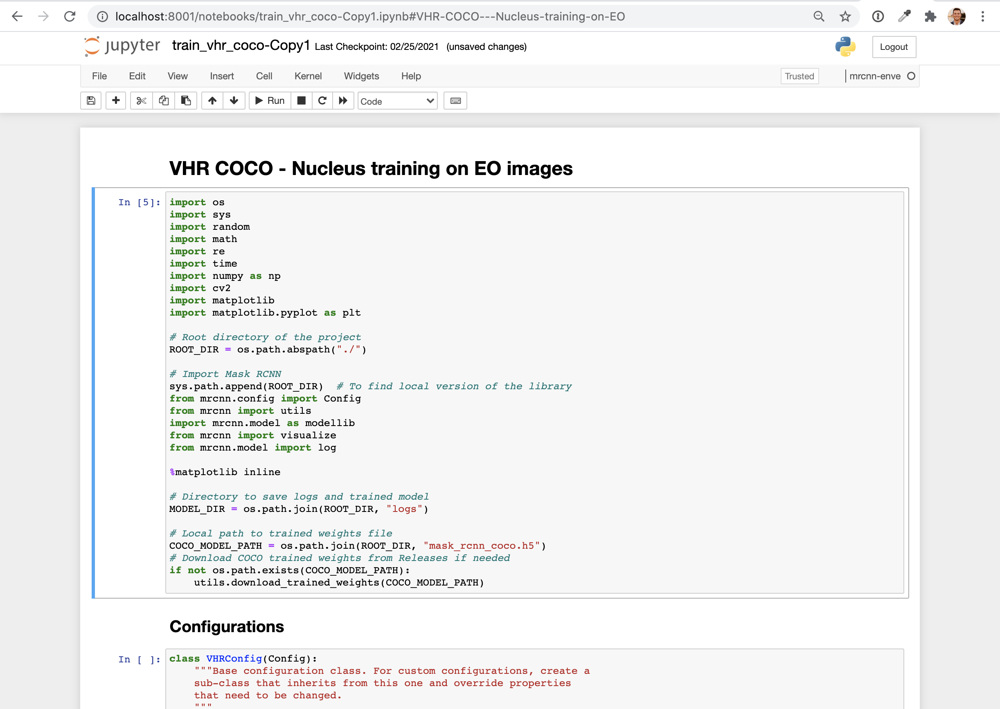
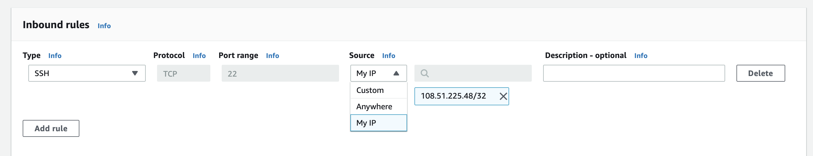

# ec2-notebook-setup

The following setup allows you to develop and train models on an ec2 instance, while developing in your native chrome browser. The following allows for each project to have a separate python shell and differing package versions.
- Project 1: python 3.8.0 with numpy version X 
- Project 2: python 3.8.0 with numpy version Y
- Project 3: python 3.7.5 with numpy version X



## Setup (first time only)
1. Navigate to Okta and open AWS, change your role to one which allows EC2 instance creation. 
2. Create a new EC2 instance (I recommend Ubuntu 18 on a box that has a graphics card, this will depend on the size of your jobs, Step 4: Add storage - bump this up since the default is 8gb)
3. Create a private key, or download the one provided during instance creation. 
4. Set the security permissions on the box (change the default inbound port 22 to 'My IP' - be aware you need to change this every time you change locations however it's an extra layer of security that is worth it)

6. Set your `~/.ssh/config` as such. Replace Hostname and IdentityFile
```
Host myNewServer
  Hostname ec2-3-129-217-106.us-east-2.compute.amazonaws.com
  IdentityFile IdentityFile ~/.ssh/bgeils_aws_key.pem
  User ubuntu
  LocalForward 8001 localhost:8888
```
6. Login to your new EC2 box `ssh myNewServer` - press enter the first time when prompted with `Are you sure you want to continue connecting (yes/no/[fingerprint])?`
7. Install tmux
```
sudo apt update
sudo apt install tmux
```
8. Install Python3
```
sudo apt install python3
```
9. Install a compiler and pyenv 
```
sudo apt install -y make build-essential libssl-dev zlib1g-dev \
 libbz2-dev libreadline-dev libsqlite3-dev wget curl llvm libncurses5-dev\
 libncursesw5-dev xz-utils tk-dev libffi-dev liblzma-dev python-openssl\
 git
curl https://pyenv.run | bash
exec $SHELL
```
Add the following `vim ~/.bash_profile`
```
export PATH="/home/ubuntu/.pyenv/bin:$PATH"
eval "$(pyenv init -)"
eval "$(pyenv virtualenv-init -)"
```
Source your bash_profile
```source ~/.bash_profile```
10. Create a new python env - pick your own version I chose 3.8.0 (Resource link: https://towardsdatascience.com/managing-virtual-environment-with-pyenv-ae6f3fb835f8)
```
mkdir envs
cd envs
pyenv install 3.8.0
```
11. Install pipenv
```
sudo apt install python3-pip
sudo -H pip3 install --pre --upgrade pipenv
```
12. Create a new project
```
mkdir ~/workspace
mkdir ~/workspace/new-project
cd ~/workspace/new-project
```
13. Start your tmux session
```tmux```
14. To change the name of your tmux window (Control + b then , ) type the new name and press enter
15. Create project specific env ([resource link](https://towardsdatascience.com/how-to-use-pipenv-with-jupyter-and-vscode-ae0e970df486#:~:text=Developing%20with%20Jupyter%20Notebook%20in%20the%20browser,-Jupyter%20Notebook%20in&text=Make%20sure%20to%20navigate%20into,afterward%20pipenv%20run%20jupyter%20notebook%20.))
```
pipenv shell
pipenv install jupyter
```
16. Start jupyter
```
pipenv run jupyter notebook
```
17. Navigate to localhost:8001 in your browser and enter the token


## Getting back into your box
1. Navigate to AWS security and update your inbound to 'My IP' which will update to your current IP address.
2. ssh into your box `ssh myNewServer`
3. Jump back into your tmux session `tmux attach`
4. Navigate to your jupyter notebook in your browser localhost:8001

## Gettting back into your project after jupyter is shut down
1. Navigate to AWS security and update your inbound to 'My IP' which will update to your current IP address.
2. ssh into your box `ssh myNewServer`
3. Jump back into your tmux session `tmux attach`
4. Navigate to your project `cd ~/workspace/new-project`
5. Activate your environment `pyenv shell`
6. Start your jupyter server `pipenv run jupyter notebook`
7. Navigate to localhost:8001 in your browser and enter the token

## Installing packages in Jupyter
1. In your jupyter notebook cell `! pipenv install <packages>`


## Installing packages in shell
1. Navigate to your project `cd ~/workspace/new-project`
2. Activate your environment `pyenv shell`
3. Install the packages
```
pipenv install <packages>
```
